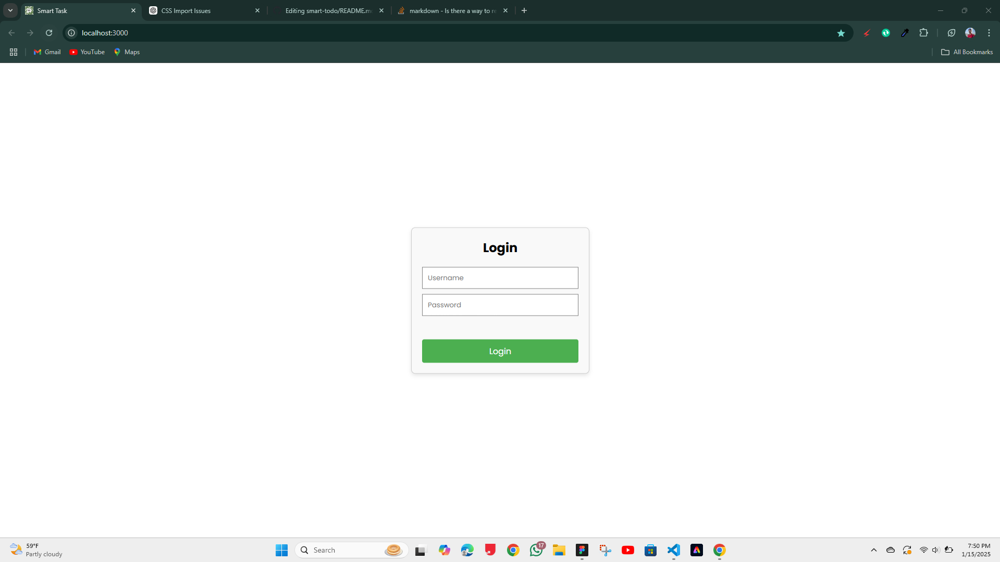
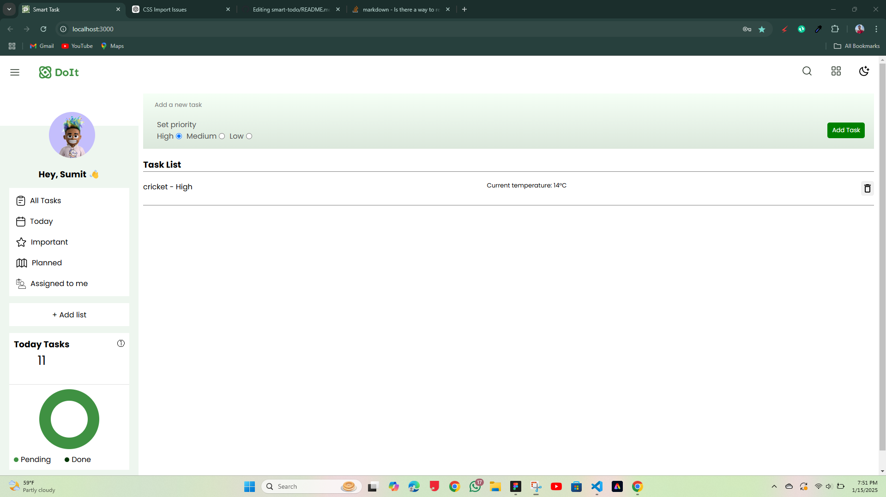
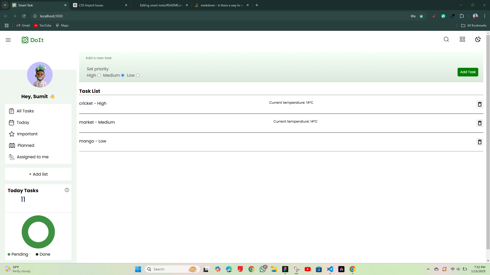
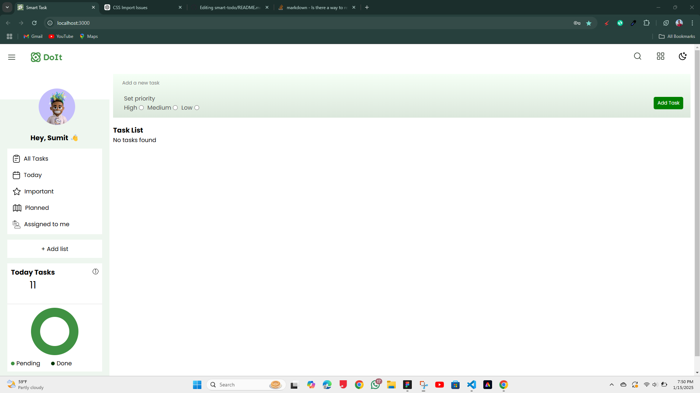

# Todo App with Weather and Login Feature

A modern and interactive Todo app built using React and Redux. This app allows you to create, read, and delete tasks with a beautiful UI. It also integrates a weather API to show the current temperature for outdoor-related tasks. It includes a simple login feature to secure access to the task list.

## Features Implemented:

### `Task Management:`
You can create, view, and delete tasks using Redux for state management.

### `Weather API:`
Displays the current temperature when tasks related to the outdoors are created (e.g., "Outdoor", "Cricket", etc.)

### `Login Feature:`
A simple login page that allows only authorized users to access the task list.

### `Responsive and Visually Appealing UI:`
Designed for a seamless user experience with a clean and modern interface.

# Screenshots:
## Login Screen:

## Task List Screen:

# Setup and Running Instructions:

## Prerequisites:
**Ensure that you have Node.js and npm installed on your machine. You can download them from [here](https://nodejs.org/en).**

**A text editor like [VS Code](https://code.visualstudio.com/) is recommended for code editing.**

## 1. Clone the repository:
First, clone the repository to your local machine using the following command:

git clone https://github.com/your-username/todo-app.git

## 2. Install dependencies:
Navigate to the project directory and install the necessary dependencies:

cd todo-app
npm install

## 3. Start the development server:
Once the dependencies are installed, you can start the development server using the following command:

npm start

The app will be available at [http://localhost:3000](http://localhost:3000) in your web browser.

## 4. Build for production:
To create a production build of the app, use:

npm run build

## 5. Additional Configuration:
**The app uses Redux for state management and React for the frontend.**

**The weather API used in this project is from [WeatherStack](https://weatherstack.com/). Make sure the API key is correct if the app is not fetching the weather data.**

### How It Works:

**1.Login Feature:**

On the initial load, the app will display a login page where users must input a username and password to access the Todo app.

The username is checked against a predefined value (sumit) and the password is dynamically checked based on the username (password_sumit).

**2. Task Management:**

After logging in, users can add tasks by entering the task name and priority. Tasks are stored in the Redux store and persist across page reloads using localStorage.

Tasks related to outdoor activities (e.g., "Outdoor", "Cricket", "Football", etc.) will show the current temperature fetched from the weather API.

**3. Weather API Integration:**

When creating tasks like "Outdoor", the app fetches the current temperature using the WeatherStack API and displays it next to the task.

his helps users know the temperature before heading out for outdoor tasks.

**4. Delete Tasks:**

Tasks can be removed from the list by clicking the delete button next to each task.

# Folder Structure:

# Technologies Used:
**React: JavaScript library for building user interfaces**

**Redux Toolkit: State management for predictable and easy-to-manage state.**

**WeatherStack API: Fetch current weather data (temperature) for outdoor-related tasks.**

**CSS: Styling for the app using modern CSS techniques.**

**React Router (if applicable): For page routing (if the app has multiple pages).**

## Contributing:
If you would like to contribute to this project, feel free to fork the repository and submit a pull request with your changes.
